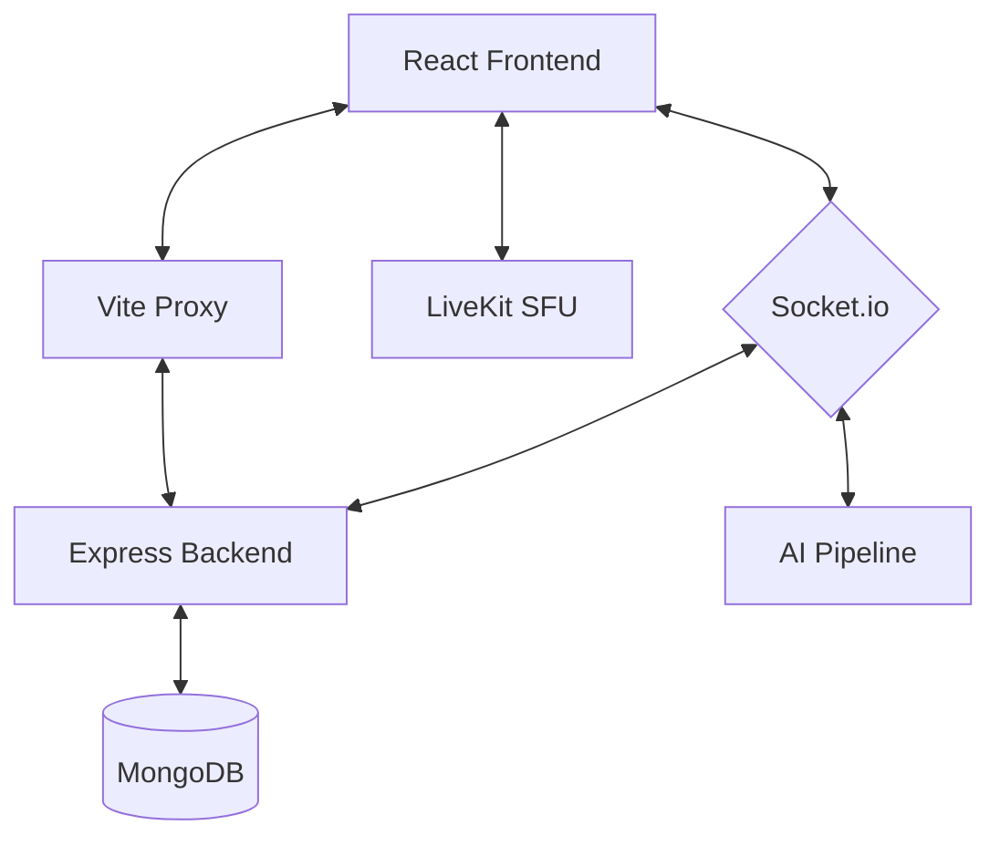

# 🚀 EchoMeet - AI-Powered Real-Time Meeting Platform

A full-stack, production-ready meeting platform built with the MERN stack, LiveKit, and integrated AI capabilities for meeting summaries and interactive hand-gesture air drawing.

## ✨ Features

| Feature               | Description                                                                                     |
| --------------------- | ----------------------------------------------------------------------------------------------- |
| **Video/Audio Calls** | High-performance conferencing via LiveKit SFU with adaptive quality.                            |
| **Screen Sharing**    | Host-controlled browser-based screen sharing and presentation modes.                            |
| **Live Chat**         | Real-time group and private messaging with persistence in MongoDB.                              |
| **Hand Raise**        | Interactive hand-raise system with a real-time queue for the host.                              |
| **AI Summaries**      | Automatic speech-to-text processing followed by key point and action item extraction using NLP. |
| **Air Drawing**       | Revolutionary gesture-based drawing on-screen using MediaPipe hand tracking.                    |
| **Auto Attendance**   | Automated participant tracking with join/leave logs and duration-based status.                  |
| **Guest Mode**        | Seamless joining via invitation links without the need for registration.                        |
| **Security**          | Robust JWT authentication, granular host permissions, and CSRF protection.                      |

## 🏗️ Architecture



## 📁 Project Structure

```text
Echomeet/
├── server/                     # Backend API & Socket Server
│   ├── src/
│   │   ├── index.js           # Main Entry Point & DB Connection
│   │   ├── middleware/        # JWT & Auth Handlers
│   │   ├── models/            # Mongoose Schemas (User, Room, etc.)
│   │   ├── routes/            # REST Endpoints
│   │   └── socket/            # Real-time Event Handlers
│   └── .env                   # Server Secrets
│
├── client/                     # Frontend Application
│   ├── src/
│   │   ├── context/           # React Context (Auth, Socket)
│   │   ├── services/          # API & Axios Config
│   │   ├── pages/             # Application Views
│   │   └── components/        # Reusable UI Elements
│   ├── .env                   # Client Environment
│   └── vite.config.js         # Vite & Proxy Configuration
│
└── README.md
```

## 🛠️ Setup Instructions

### Prerequisites

- **Node.js** (v18 or higher)
- **MongoDB** (Local instance or Atlas cluster)
- **LiveKit Server** (Cloud or self-hosted)

### 1. Installation

```bash
# Clone the repository
git clone <repository-url>
cd videocallingapp

# Install backend dependencies
cd server
npm install

# Install frontend dependencies
cd ../client
npm install
```

### 2. Environment Configuration

**Backend (`server/.env`):**

```env
PORT=5000
MONGODB_URI=your_mongodb_connection_string
JWT_SECRET=your_jwt_secret
JWT_EXPIRE=7d
LIVEKIT_URL=wss://your-livekit-url.livekit.cloud
LIVEKIT_API_KEY=your_api_key
LIVEKIT_API_SECRET=your_api_secret
CLIENT_URL=http://localhost:5173
```

**Frontend (`client/.env`):**

```env
VITE_LIVEKIT_URL=wss://your-livekit-url.livekit.cloud
VITE_PUBLIC_APP_URL=http://localhost:5173
VITE_API_URL=/api
VITE_BACKEND_URL=http://localhost:5000
```

For production, configure these values in your deployment provider environment settings:

```env
VITE_PUBLIC_APP_URL=https://echomeet-frontend-t85p.onrender.com
VITE_API_URL=https://<your-backend-domain>/api
VITE_BACKEND_URL=https://<your-backend-domain>
```

### 3. Running Locally

Start the backend and frontend in separate terminals:

**Terminal 1 (Backend):**

```bash
cd server
npm run dev
```

**Terminal 2 (Frontend):**

```bash
cd client
npm run dev
```

The application will be accessible at: **http://localhost:5173**

## 🌐 Production Routing (SPA Deep Links)

When using `BrowserRouter`, direct navigation to routes like `/join/8E78CA09` requires a server-side rewrite to `index.html`.

This repository now includes [render.yaml](render.yaml) with:

- Static frontend service build/publish settings
- A rewrite rule from `/*` to `/index.html`

Without this rewrite, production deep links will return **Not Found** on refresh/direct open.

## 💡 Troubleshooting & Common Fixes

### WebSocket Errors (ECONNRESET)

If you encounter `ws proxy socket error` in the Vite terminal:

- **Transports:** Ensure `Socket.io` is initialized with `['polling', 'websocket']` transports (polling **must** come first for the initial handshake).
- **Vite Proxy:** The `vite.config.js` must have `secure: false` and error-handling in the proxy configuration to prevent crashing the HTTP proxy.

### Registration Issues

If registration fails unexpectedly:

- **Bcrypt Rounds:** Ensure `bcrypt` hashing rounds are set to `10`. Higher values (like 12) can cause async race conditions during Mongoose's `pre('save')` hook.
- **Stale Indexes:** If you see `duplicate key error: username_1`, the database has a stale index from a previous schema. The backend includes a one-time cleanup to drop such indexes on startup.

## 🧪 Testing

- Use **Incognito windows** to test multiple participants locally.
- Use the **Air Drawing** feature by ensuring your camera is enabled and using clear hand gestures.
- Check the **AI Summary** panel after a call to see the generated meeting insights.

## 🔒 Security

- **JWT Authorization:** Secured endpoints with token verification.
- **CSRF Protection:** Configured CORS to restrict access to trusted origins.
- **Host Privileges:** Only meeting creators can end sessions or manage permissions.

## 📝 License

This project is licensed under the MIT License.
